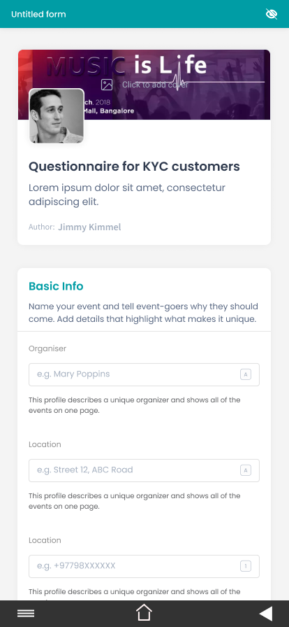
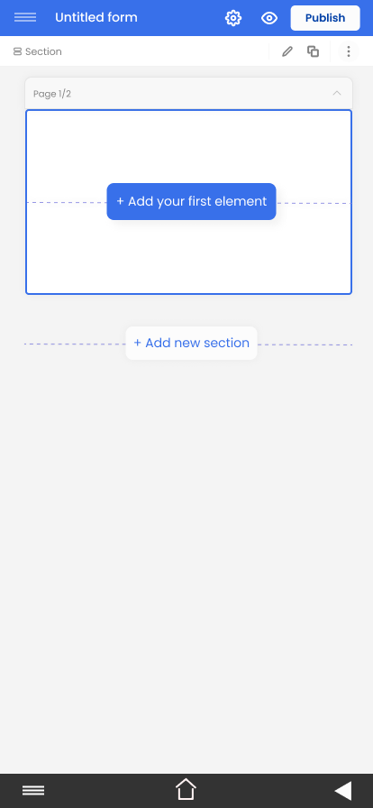
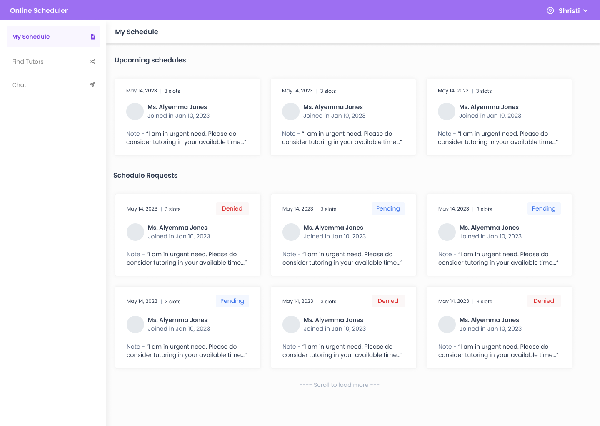
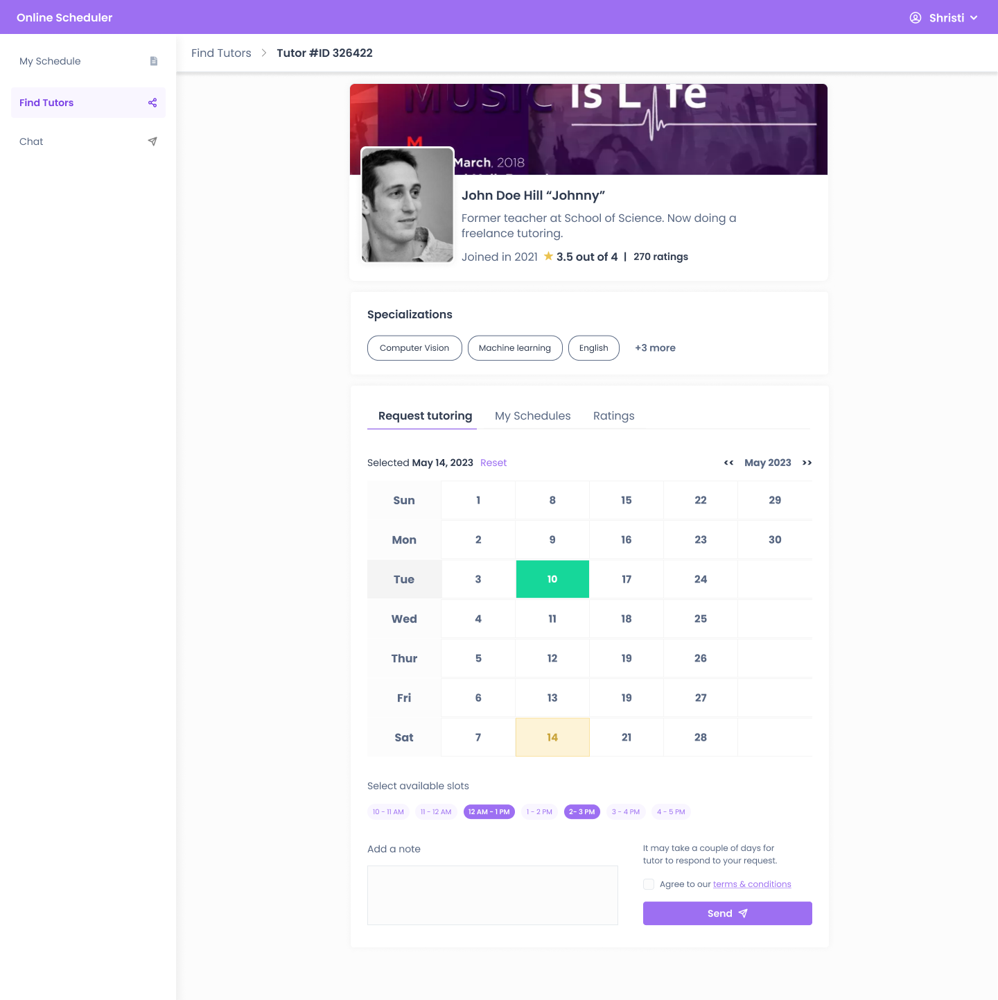

## Figma-Mockups

As a part of learning Figma, I created a UI designs for form builder app. Check out the snapshots of main pages. For more details, send me an email.

# Form Builder
- Highly customizable forms create by simple clicks.
- Mobile friendly view
- View all your forms in one place

# Online Tutor Scheduler
- Students can request for tutoring based on Tutor's available time slots.
- Tutors can manage all their schedules from one place.
- Rate your tutors with your favorite emojis.

## As a student

